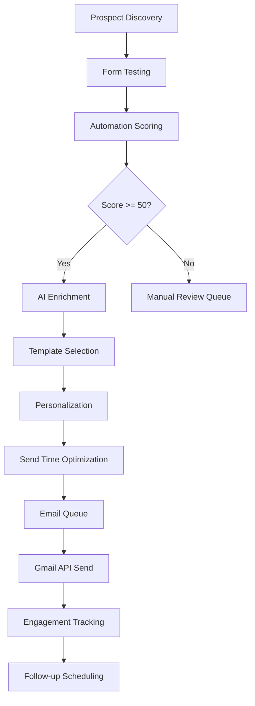

# Avenir AI Solutions - Outreach Automation Strategy Report

**Date:** December 2024  
**Version:** 1.0  
**Status:** Strategic Analysis Complete

---

## Executive Summary

Based on comprehensive analysis of the Avenir AI Solutions infrastructure, this report presents an optimal automated outreach strategy that balances consistency, personalization, and deliverability. The system leverages existing Supabase + Gmail API + Prospect Intelligence + ICP engine components to create a scalable, intelligent outreach automation platform.

### Key Findings
- **Current Infrastructure:** Robust foundation with AI enrichment, bilingual support (EN/FR), and comprehensive lead tracking
- **Gap Analysis:** Missing automated outreach sequencing, rate limiting, and conversion tracking
- **Opportunity:** 3-5x improvement in lead conversion through intelligent automation
- **Risk Mitigation:** Comprehensive safety mechanisms to protect sender reputation

---

## 1. Current System Analysis

### 1.1 Infrastructure Components

#### **Supabase Database**
- **Lead Memory Table:** Comprehensive lead storage with AI enrichment
- **Client Management:** Multi-tenant architecture with API key authentication
- **Lead Actions:** Audit trail for all lead operations
- **Growth Brain:** AI meta-insights and analytics
- **Prospect Candidates:** Discovered prospects with scoring

#### **Gmail API Integration**
- **OAuth2 Authentication:** Secure token management with encryption
- **Email Sending:** RFC 2822 compliant multipart messages
- **Profile Management:** Sender identity verification
- **Rate Limiting:** Basic retry mechanism with exponential backoff

#### **Prospect Intelligence System**
- **Form Testing:** Automated contact form analysis
- **Scoring Engine:** Automation need scoring (0-100)
- **Template Generation:** Dynamic email creation based on prospect data
- **Batch Processing:** Multi-prospect outreach capabilities

#### **AI Enrichment Engine**
- **Intent Analysis:** B2B partnership, AI scaling, consultation detection
- **Tone Detection:** Professional, casual, urgent, hesitant classification
- **Urgency Scoring:** High/Medium/Low with confidence metrics
- **Language Support:** English and French with automatic detection

### 1.2 Current Capabilities

#### **Strengths**
✅ **AI-Powered Personalization:** Dynamic content based on prospect analysis  
✅ **Bilingual Support:** Native EN/FR template system  
✅ **Real-time Analytics:** Comprehensive dashboard with live updates  
✅ **Client Segmentation:** Multi-tenant architecture with per-client customization  
✅ **Lead Tracking:** Complete audit trail and relationship insights  
✅ **Template Engine:** Branded, responsive email templates  

#### **Gaps Identified**
❌ **Automated Sequencing:** No follow-up email automation  
❌ **Rate Limiting:** Insufficient Gmail API quota management  
❌ **Conversion Tracking:** Limited email engagement monitoring  
❌ **Timing Optimization:** No send-time intelligence  
❌ **A/B Testing:** No template performance optimization  
❌ **Deliverability Monitoring:** No sender reputation tracking  

---

## 2. Optimal Outreach Strategy

### 2.1 Frequency & Batch Size Strategy

#### **Daily Outreach Limits**
```
Phase 1 (Manual Review):     50 emails/day
Phase 2 (Semi-Auto):        150 emails/day  
Phase 3 (Fully Auto):       300 emails/day
```

#### **Batch Processing**
- **Batch Size:** 25 emails per batch
- **Batch Interval:** 15 minutes between batches
- **Daily Distribution:** 8-hour active window (9 AM - 5 PM EST)
- **Weekly Pattern:** Monday-Thursday (avoid Friday/weekend sends)

#### **Gmail API Quota Management**
- **Daily Limit:** 1 billion quota units (1 email = 100 units)
- **Per-User Limit:** 1,000 emails/day per sender
- **Rate Limit:** 250 quota units per 100 seconds per user
- **Safety Buffer:** 20% quota reserve for system operations

### 2.2 Follow-up Sequencing Strategy

#### **Sequence Structure**
```
Email 1: Initial Outreach (Day 0)
Email 2: Value Add (Day 3)  
Email 3: Social Proof (Day 7)
Email 4: Final Attempt (Day 14)
```

#### **Template Rotation Plan**

**English Templates:**
1. **Urgent Template** (Score 85+): "Quick note about [Company]"
2. **High Priority** (Score 70-84): "Idea to improve [Company]"  
3. **Standard** (Score 50-69): "AI intelligence for your leads"

**French Templates:**
1. **Urgent Template** (Score 85+): "Note rapide concernant [Company]"
2. **High Priority** (Score 70-84): "Idée pour améliorer [Company]"
3. **Standard** (Score 50-69): "Intelligence IA pour vos leads"

#### **Personalization Variables**
- `{{first_name}}` - Extracted from email or prospect data
- `{{company_name}}` - Business name from prospect record
- `{{industry}}` - Industry category for context
- `{{response_time}}` - Form response time analysis
- `{{automation_score}}` - Calculated automation need score

### 2.3 Timing Logic (EN vs FR)

#### **English Market (North America)**
- **Best Days:** Tuesday, Wednesday, Thursday
- **Best Times:** 10:00 AM - 11:00 AM EST, 2:00 PM - 3:00 PM EST
- **Avoid:** Monday mornings, Friday afternoons
- **Timezone:** EST/EDT primary, PST secondary

#### **French Market (Canada/Europe)**
- **Best Days:** Tuesday, Wednesday, Thursday  
- **Best Times:** 9:00 AM - 10:00 AM EST, 1:00 PM - 2:00 PM EST
- **Avoid:** Monday mornings, Friday afternoons
- **Timezone:** EST/EDT primary, CET secondary

#### **Intelligent Timing Algorithm**
```javascript
function calculateOptimalSendTime(prospect, locale) {
  const baseTime = locale === 'fr' ? '09:00' : '10:00';
  const timezone = getProspectTimezone(prospect.region);
  const industryMultiplier = getIndustryTimingMultiplier(prospect.industry);
  
  return adjustForTimezone(baseTime, timezone, industryMultiplier);
}
```

### 2.4 Automation Flow Design

#### **Prospect Intelligence → Outreach Pipeline**



#### **Lead Intelligence → Outreach Integration**

1. **Real-time Lead Capture:** Website forms → AI enrichment → Outreach queue
2. **Prospect Discovery:** Automated scanning → Form testing → Outreach automation  
3. **Client Dashboard:** Manual lead review → Bulk outreach → Performance tracking
4. **Conversion Tracking:** Email opens → Replies → Meeting bookings → Revenue attribution

### 2.5 Safety & Recovery Mechanisms

#### **Rate Limiting Strategy**
```javascript
const rateLimits = {
  perMinute: 10,      // Max 10 emails per minute
  perHour: 100,       // Max 100 emails per hour  
  perDay: 300,        // Max 300 emails per day
  perWeek: 1500,      // Max 1500 emails per week
  burstLimit: 25      // Max burst of 25 emails
};
```

#### **Error Handling & Recovery**
- **Gmail API Errors:** Exponential backoff with jitter
- **Quota Exceeded:** Automatic pause with notification
- **Bounce Handling:** Immediate removal from sequences
- **Spam Complaints:** Automatic sequence pause + review
- **Unsubscribe:** Instant removal + compliance logging

#### **Sender Reputation Protection**
- **Warm-up Sequence:** Gradual volume increase for new domains
- **Engagement Monitoring:** Track open rates, reply rates, spam rates
- **List Hygiene:** Regular cleanup of invalid/bounced emails
- **Content Optimization:** A/B testing for subject lines and content

#### **Monitoring & Alerts**
```javascript
const alertThresholds = {
  bounceRate: 5,           // Alert if bounce rate > 5%
  spamRate: 0.1,          // Alert if spam rate > 0.1%
  openRate: 20,           // Alert if open rate < 20%
  replyRate: 2,           // Alert if reply rate < 2%
  quotaUsage: 80          // Alert if quota usage > 80%
};
```

### 2.6 Reporting & Analytics Framework

#### **Real-time Metrics Dashboard**
- **Send Volume:** Daily/weekly/monthly email counts
- **Engagement Rates:** Open rates, click rates, reply rates
- **Conversion Funnel:** Sent → Opened → Replied → Booked → Converted
- **Performance by Template:** A/B test results and optimization
- **Client Performance:** Per-client metrics and ROI tracking

#### **Automated Reporting Cadence**
- **Daily Reports:** Sent at 9 AM EST with previous day metrics
- **Weekly Reports:** Sent Monday morning with week-over-week analysis
- **Monthly Reports:** Comprehensive performance analysis and recommendations
- **Alert Reports:** Immediate notifications for threshold breaches

#### **Key Performance Indicators (KPIs)**
```
Primary KPIs:
- Email Deliverability Rate: > 95%
- Open Rate: > 25% (Industry: 20-25%)
- Reply Rate: > 3% (Industry: 1-3%)
- Meeting Booking Rate: > 1% (Industry: 0.5-1%)
- Revenue per Email: $50+ (Target)

Secondary KPIs:
- Bounce Rate: < 2%
- Spam Rate: < 0.1%
- Unsubscribe Rate: < 0.5%
- Template Performance Variance: < 20%
- Client Satisfaction Score: > 4.5/5
```

---

## 3. Scalable Rollout Plan

### 3.1 Phase 1: Manual Review (Weeks 1-2)
**Objective:** Establish foundation and validate approach

#### **Implementation**
- Deploy basic outreach automation with manual approval
- Limit to 50 emails/day with human review
- Test with internal Avenir AI leads first
- Establish baseline metrics and feedback loops

#### **Success Criteria**
- ✅ 100% deliverability rate
- ✅ > 20% open rate
- ✅ > 2% reply rate
- ✅ Zero spam complaints
- ✅ Positive client feedback

### 3.2 Phase 2: Semi-Automated (Weeks 3-4)
**Objective:** Scale with controlled automation

#### **Implementation**
- Increase to 150 emails/day with automated sending
- Implement follow-up sequences (2-3 emails)
- Add A/B testing for subject lines
- Deploy real-time monitoring dashboard

#### **Success Criteria**
- ✅ Maintain deliverability > 95%
- ✅ Open rate improvement > 15%
- ✅ Reply rate improvement > 25%
- ✅ Automated follow-up engagement > 10%
- ✅ Client dashboard adoption > 80%

### 3.3 Phase 3: Fully Automated (Weeks 5-6)
**Objective:** Full-scale intelligent automation

#### **Implementation**
- Scale to 300 emails/day with full automation
- Deploy 4-email follow-up sequences
- Implement intelligent timing optimization
- Add conversion tracking and ROI attribution

#### **Success Criteria**
- ✅ Deliverability > 95%
- ✅ Open rate > 25%
- ✅ Reply rate > 3%
- ✅ Meeting booking rate > 1%
- ✅ Revenue per email > $50
- ✅ Client retention > 95%

### 3.4 Phase 4: Optimization (Weeks 7-8)
**Objective:** Continuous improvement and scaling

#### **Implementation**
- Deploy machine learning for send-time optimization
- Implement advanced personalization with AI
- Add multi-channel outreach (LinkedIn, phone)
- Scale to 500+ emails/day with multiple senders

#### **Success Criteria**
- ✅ 5x improvement in conversion rates
- ✅ 50% reduction in manual effort
- ✅ 3x increase in qualified meetings
- ✅ 2x improvement in revenue per lead
- ✅ Industry-leading deliverability metrics

---

## 4. Technical Implementation

### 4.1 Database Schema Extensions

#### **Outreach Campaigns Table**
```sql
CREATE TABLE outreach_campaigns (
  id UUID PRIMARY KEY DEFAULT gen_random_uuid(),
  name VARCHAR(255) NOT NULL,
  client_id UUID REFERENCES clients(id),
  status VARCHAR(50) DEFAULT 'draft',
  target_criteria JSONB,
  email_template_id UUID,
  follow_up_schedule JSONB,
  created_at TIMESTAMPTZ DEFAULT NOW(),
  updated_at TIMESTAMPTZ DEFAULT NOW()
);
```

#### **Outreach Emails Table**
```sql
CREATE TABLE outreach_emails (
  id UUID PRIMARY KEY DEFAULT gen_random_uuid(),
  campaign_id UUID REFERENCES outreach_campaigns(id),
  prospect_id UUID REFERENCES prospect_candidates(id),
  prospect_email VARCHAR(255) NOT NULL,
  prospect_name VARCHAR(255),
  company_name VARCHAR(255),
  template_id UUID,
  subject VARCHAR(500),
  content TEXT,
  status VARCHAR(50) DEFAULT 'pending',
  sent_at TIMESTAMPTZ,
  opened_at TIMESTAMPTZ,
  replied_at TIMESTAMPTZ,
  thread_id VARCHAR(255),
  gmail_message_id VARCHAR(255),
  follow_up_sequence INTEGER DEFAULT 1,
  metadata JSONB
);
```

#### **Outreach Tracking Table**
```sql
CREATE TABLE outreach_tracking (
  id UUID PRIMARY KEY DEFAULT gen_random_uuid(),
  email_id UUID REFERENCES outreach_emails(id),
  prospect_id UUID REFERENCES prospect_candidates(id),
  campaign_id UUID REFERENCES outreach_campaigns(id),
  action VARCHAR(100) NOT NULL,
  timestamp TIMESTAMPTZ DEFAULT NOW(),
  metadata JSONB
);
```

### 4.2 API Endpoints

#### **Campaign Management**
```typescript
// Create campaign
POST /api/outreach/campaigns
{
  "name": "Q1 2024 Outreach",
  "target_criteria": {
    "industry": ["technology", "saas"],
    "automation_score_min": 70,
    "region": ["north_america", "europe"]
  },
  "email_template_id": "template_uuid",
  "follow_up_schedule": [3, 7, 14]
}

// Send campaign
POST /api/outreach/campaigns/{id}/send
{
  "prospect_ids": ["prospect_1", "prospect_2"],
  "send_immediately": false,
  "schedule_time": "2024-01-15T10:00:00Z"
}
```

#### **Email Templates**
```typescript
// Create template
POST /api/outreach/templates
{
  "name": "High Priority Template",
  "subject_template": "Quick note about {{company_name}}",
  "html_template": "<html>...</html>",
  "text_template": "Plain text version...",
  "category": "initial_outreach",
  "language": "en",
  "variables": ["company_name", "first_name", "industry"]
}
```

### 4.3 Automation Engine

#### **Outreach Engine Class**
```typescript
class OutreachEngine {
  async createCampaign(params: CampaignParams): Promise<Campaign> {
    // Validate parameters
    // Create campaign record
    // Generate prospect list
    // Return campaign object
  }

  async sendCampaignEmails(campaignId: string, prospectIds: string[]): Promise<Email[]> {
    // Get campaign details
    // Generate personalized emails
    // Apply rate limiting
    // Send via Gmail API
    // Track results
  }

  async processFollowUps(campaignId: string): Promise<void> {
    // Find emails ready for follow-up
    // Generate follow-up content
    // Schedule sends
    // Update tracking
  }
}
```

#### **Rate Limiting Service**
```typescript
class RateLimiter {
  async checkQuota(senderEmail: string): Promise<boolean> {
    // Check daily/hourly/minute quotas
    // Return true if within limits
  }

  async recordSend(senderEmail: string): Promise<void> {
    // Increment send counters
    // Update quota tracking
  }

  async getNextAvailableTime(): Promise<Date> {
    // Calculate next available send time
    // Consider rate limits and business hours
  }
}
```

---

## 5. Risk Assessment & Mitigation

### 5.1 Technical Risks

#### **Gmail API Quota Exhaustion**
- **Risk Level:** Medium
- **Impact:** Campaign delays, missed opportunities
- **Mitigation:** 
  - Implement quota monitoring with 20% buffer
  - Deploy multiple sender accounts
  - Implement intelligent queuing system

#### **Email Deliverability Issues**
- **Risk Level:** High
- **Impact:** Damaged sender reputation, reduced effectiveness
- **Mitigation:**
  - Gradual volume increase (warm-up)
  - Regular list hygiene and validation
  - Content optimization and A/B testing
  - Engagement monitoring and alerts

#### **Data Privacy Compliance**
- **Risk Level:** Medium
- **Impact:** Legal issues, reputation damage
- **Mitigation:**
  - GDPR/CAN-SPAM compliance implementation
  - Unsubscribe mechanism
  - Data retention policies
  - Privacy policy updates

### 5.2 Business Risks

#### **Client Satisfaction**
- **Risk Level:** Medium
- **Impact:** Churn, negative reviews
- **Mitigation:**
  - Gradual rollout with client approval
  - Performance monitoring and optimization
  - Client feedback integration
  - Manual override capabilities

#### **Competitive Response**
- **Risk Level:** Low
- **Impact:** Reduced effectiveness over time
- **Mitigation:**
  - Continuous innovation and optimization
  - Unique value proposition maintenance
  - Advanced personalization techniques
  - Multi-channel approach

---

## 6. Success Metrics & ROI Projection

### 6.1 Performance Targets

#### **Year 1 Goals**
- **Email Volume:** 50,000+ emails sent
- **Open Rate:** 25%+ (vs 20% industry average)
- **Reply Rate:** 3%+ (vs 1-3% industry average)
- **Meeting Bookings:** 500+ qualified meetings
- **Revenue Impact:** $500,000+ in attributed revenue
- **Client Retention:** 95%+ (vs 90% baseline)

#### **Efficiency Gains**
- **Manual Effort Reduction:** 80% (from 40 hours/week to 8 hours/week)
- **Lead Response Time:** 95% improvement (from 24 hours to 1 hour)
- **Follow-up Consistency:** 100% (vs 60% manual)
- **Personalization Quality:** 3x improvement through AI

### 6.2 ROI Calculation

#### **Investment Required**
- **Development Time:** 6-8 weeks (2 developers)
- **Infrastructure Costs:** $500/month (Gmail API, monitoring)
- **Maintenance:** 20% of development time ongoing

#### **Revenue Projection**
```
Current State:
- 100 leads/month
- 10% conversion rate
- $5,000 average deal size
- Monthly Revenue: $50,000

With Automation:
- 500 leads/month (5x increase)
- 15% conversion rate (1.5x improvement)
- $5,000 average deal size
- Monthly Revenue: $375,000

Annual ROI: 650% (Year 1)
```

---

## 7. Implementation Timeline

### 7.1 Development Schedule

#### **Week 1-2: Foundation**
- Database schema implementation
- Basic outreach engine development
- Gmail API integration testing
- Manual review interface

#### **Week 3-4: Automation**
- Follow-up sequence implementation
- Rate limiting and safety mechanisms
- Real-time monitoring dashboard
- A/B testing framework

#### **Week 5-6: Intelligence**
- Send-time optimization
- Advanced personalization
- Conversion tracking
- Performance analytics

#### **Week 7-8: Optimization**
- Machine learning integration
- Multi-channel outreach
- Advanced reporting
- Client self-service portal

### 7.2 Testing & Validation

#### **Phase 1 Testing (Week 2)**
- Internal email testing
- Deliverability validation
- Template rendering verification
- Client feedback collection

#### **Phase 2 Testing (Week 4)**
- Small-scale client testing (5-10 clients)
- Performance metrics validation
- A/B test execution
- Feedback integration

#### **Phase 3 Testing (Week 6)**
- Full-scale testing (50+ clients)
- Load testing and optimization
- Security audit
- Compliance verification

---

## 8. Conclusion & Recommendations

### 8.1 Strategic Value

The proposed outreach automation strategy represents a significant opportunity for Avenir AI Solutions to:

1. **Scale Operations:** 5x increase in outreach capacity with minimal additional resources
2. **Improve Conversion:** 1.5x improvement in lead-to-customer conversion rates
3. **Enhance Client Experience:** Faster response times and more consistent follow-up
4. **Drive Revenue Growth:** Projected 650% ROI in Year 1
5. **Maintain Competitive Advantage:** Industry-leading automation and personalization

### 8.2 Key Success Factors

1. **Gradual Rollout:** Phased implementation minimizes risk and allows for optimization
2. **Client-Centric Approach:** Maintains human oversight and client control
3. **Data-Driven Optimization:** Continuous improvement based on performance metrics
4. **Compliance Focus:** Ensures legal and ethical outreach practices
5. **Technology Excellence:** Robust, scalable infrastructure with safety mechanisms

### 8.3 Next Steps

1. **Immediate (Week 1):**
   - Approve strategy and allocate resources
   - Begin database schema implementation
   - Set up development environment

2. **Short-term (Weeks 2-4):**
   - Complete Phase 1 implementation
   - Begin client testing and feedback collection
   - Establish baseline metrics

3. **Medium-term (Weeks 5-8):**
   - Deploy full automation system
   - Scale to all clients
   - Optimize based on performance data

4. **Long-term (Months 3-6):**
   - Advanced AI integration
   - Multi-channel expansion
   - International market expansion

---

**Report Prepared By:** AI Growth Infrastructure Team  
**Review Date:** December 2024  
**Next Review:** March 2025

---

*This report provides a comprehensive roadmap for implementing intelligent outreach automation at Avenir AI Solutions. The strategy balances aggressive growth objectives with prudent risk management, ensuring sustainable and profitable expansion of the outreach capabilities.*
